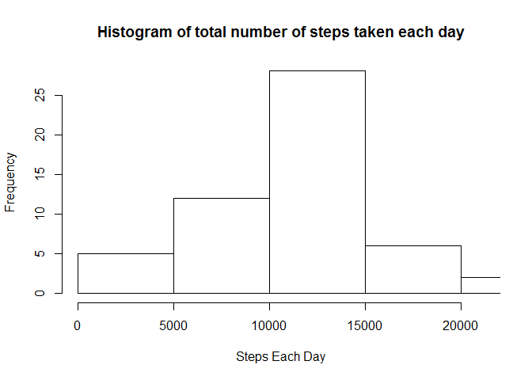
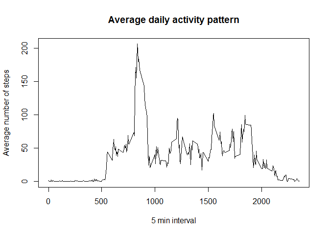
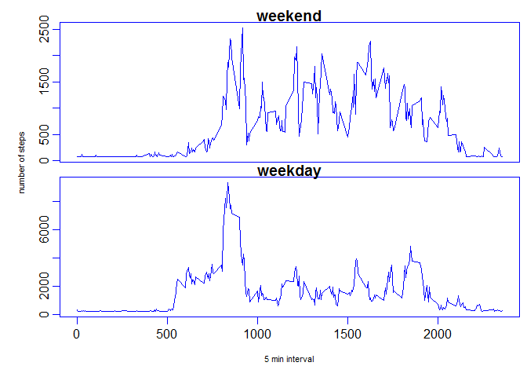

# Reproducible Research: Peer Assessment 1
# set global chunk options

```r
options(digits=2,width=90,echo=TRUE)
```
## Loading and preprocessing the data
* Make sure the datafile  is in the working directory

```r
allData= read.csv("activity.csv")
```

## What is mean total number of steps taken per day?
* Ignore Missing values  
* Steps taken Each day  
* Histogram plot
* calculate Mean and median

```r
allDataNoNa=allData[complete.cases(allData),]  
stepsEachDay = aggregate(allDataNoNa[, c(1,3)], list(allDataNoNa$date), sum)  
hist(stepsEachDay[,2],xlim=range(stepsEachDay[,2]), xlab="Steps Each Day",main="Histogram of total number of steps taken each day")  
```

 

```r
meanStepsEachDay = mean(stepsEachDay[,2])
medianStepsEachDay=median(stepsEachDay[,2])  
```
### Mean number of steps each day = 10766
### Median of the number of steps each day = 10765

## What is the average daily activity pattern?
* calculate mean steps in each 5 min interval across days  
* plot a time series xaxis- interval and yaxis- mean number of steps  
* Extract the 5 minute interval with maximum number of steps

```r
meanStepsEach5MinInterval = aggregate(allDataNoNa[, c(1,3)], list(allDataNoNa$interval), mean)  
plot(meanStepsEach5MinInterval[,3],meanStepsEach5MinInterval[,2],xlab="5 min interval",ylab="Average number of steps",type="l",main="Average daily activity pattern")
```

 

```r
indexOf5MinIntervalHasMaxSteps <- which(meanStepsEach5MinInterval$steps >= max(meanStepsEach5MinInterval$steps))
which5MinIntervalHasMaxSteps <- meanStepsEach5MinInterval[indexOf5MinIntervalHasMaxSteps,]$interval
```
### The 5 minute interval with maximum number of steps averaged across all days = 835
## Imputing missing values
* total number of missing values in the dataset

```r
  totalNumberOfMissingValues <- sum(is.na(allData))
```
### There are 2304 missing values in the dataset.
### Copy the original dataset
### Fill in the unavailable values with mean steps of all days (37.38) in a five minute interval in the copied dataset
### Make a histogram with the modified datase. calculate the mean and median of the modified dataset

```r
allDataNaReplaced <- allData  
allDataNaReplaced$steps[is.na(allDataNaReplaced$steps)]<-mean(meanStepsEach5MinInterval[,2])
stepsEachDayModDataset = aggregate(allDataNaReplaced[, c(1,3)], list(allDataNaReplaced$date), sum)  
hist(stepsEachDayModDataset[,2],xlim=range(stepsEachDayModDataset[,2]), xlab="Steps Each Day Modified Dataset",main="Histogram of total number of steps taken each day modified dataset")  
```

 

```r
meanStepsEachDayModDataset = mean(stepsEachDayModDataset[,2])
medianStepsEachDayModDataset= median(stepsEachDayModDataset[,2])  
```
### Mean number of steps each day (using Modified dataset) = 10766
### Median of the number of steps each day (using Modified dataset) = 10766
### Imputing the dataset resulterd in:
* There was no change in the mean (1.08\times 10^{4} and 1.08\times 10^{4}) however the median changed (10765 and 1.08\times 10^{4})  
* the estimate for the total daily number of steps remained the same per day
## Are there differences in activity patterns between weekdays and weekends?
* add weekday to the dataframe
* Create factor variable
* Monday, Tuesday, Wednesday, Thursday, and Friday are weekdays. Saturday and Sunday are weekend
* Summarize data based on WeekDay and WeekEnd
* Make the panel plot

```r
allDataNaReplaced$weekEndOrDay <- ifelse(weekdays(as.Date(allDataNaReplaced$date)) %in% c("Saturday","Sunday"), "weekend", "weekday")
allDataNaReplaced$weekEndOrDay <- as.factor(allDataNaReplaced$weekEndOrDay)
stepsEachDayModDatasetWeekEndOrDay = aggregate(allDataNaReplaced[, c(1,3)], list(allDataNaReplaced$weekEndOrDay,allDataNaReplaced$interval), sum)  
par(mfrow=c(2,1),mai=c(0.5,0.5,0.5,0.5))  
par(mar = c(0, 0, 1, 0), oma = c(4, 4, 0.5, 0.5))
par(mgp = c(2, 0.6, 0))
par(fg="blue", col.axis="black")
plot(stepsEachDayModDatasetWeekEndOrDay$Group.2[stepsEachDayModDatasetWeekEndOrDay$Group.1=="weekend"],stepsEachDayModDatasetWeekEndOrDay$steps[stepsEachDayModDatasetWeekEndOrDay$Group.1=="weekend"],type="l",main="weekend",xaxt="n")
plot(stepsEachDayModDatasetWeekEndOrDay$Group.2[stepsEachDayModDatasetWeekEndOrDay$Group.1=="weekday"],stepsEachDayModDatasetWeekEndOrDay$steps[stepsEachDayModDatasetWeekEndOrDay$Group.1=="weekday"],type="l",main="weekday")
mtext("5 min interval", side = 1, outer = TRUE, cex = 0.7, line = 2.2,col="black")
mtext("number of steps", side = 2, outer = TRUE, cex = 0.7, line = 2.2,col="black")
```

 
